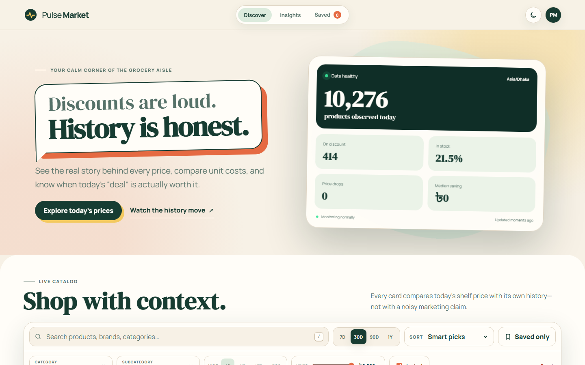

# Pulse Market — Meena Bazar price-history site

Independent grocery price-history and deal-discovery archive for Meena Bazar. Live at <https://ranehal.github.io/meena-analytics/>.

**Not affiliated with, sponsored by, or endorsed by Meena Bazar.**

## What this is

A static site (no build step) served from GitHub Pages:

- `index.html`, `styles.css`, `app.js` — the single-page app
- `catalog.json` — current normalized catalog (~10k products)
- `sections.json`, `meta.json` — home sections and health stats
- `history_*.json` — 256 on-demand price-history shards (product `id % 256`), each holding compact `{from, to, price}` segments
- `.github/workflows/update-data.yml` — daily 06:30 Asia/Dhaka catalog refresh

The frontend lazy-loads only the shard it needs per product and expands segments into daily price points for the chart.

## Scrape & update data

```bash
python -m venv .venv && source .venv/bin/activate   # or runall.bat on Windows
pip install -r requirements.txt
python scrape.py
```

The scraper writes `catalog.json`, `sections.json`, `meta.json`, and `history_*.json` to the repo root (set `MEENA_OUTPUT_DIR` to change).

## GitHub Actions

Add `MEENA_BEARER_TOKEN` under **Repository settings → Secrets and variables → Actions**. The included workflow runs daily, commits only changed `*.json`, and pushes to `main`, which auto-publishes to GitHub Pages.

## Security

Do **not** commit the HAR (`*.har`) — it contains a reusable bearer credential and personal account data. Rotate any exposed token. Use only an account and API access you are authorized to automate, with a conservative request rate and the service's applicable terms.

---

## 📸 Screenshots



---

## 🚀 Future Work & Industrial Roadmap

To elevate this platform to an enterprise-grade, production-ready product meeting current industrial standards, the following strategic goals and architecture enhancements are planned:

### 1. 🏗️ High-Availability Microservices & Infrastructure
- **Containerization & Orchestration**: Package ingestion workers, APIs, and dashboards into Docker containers with deployment via **Kubernetes (K8s)** and Helm charts for autoscaling during peak traffic hours.
- **Distributed Ingestion Workers**: Transition from localized scraping scripts to an asynchronous, fault-tolerant worker pool utilizing **Celery + Redis** or **Temporal.io** with automated proxy rotation, rate-limiting retry strategies, and CAPTCHA bypass capabilities.
- **High-Performance API Gateway**: Implement an enterprise API Gateway (Kong / Envoy) providing OAuth2 / JWT authentication, TLS termination, and granular rate limiting (Token Bucket algorithm).

### 2. 📊 Enterprise Data Engineering & Streaming Pipelines
- **Data Lakehouse Architecture**: Store multi-year raw price histories using **Apache Parquet / Delta Lake** or **Google BigQuery** for scalable analytical queries across millions of SKU updates.
- **Real-Time CDC & Message Streaming**: Integrate **Apache Kafka** or **NATS** for Change Data Capture (CDC) to stream price change events instantly to downstream analytics and notification consumers.
- **Automated Workflow Orchestration**: Schedule and monitor data ingestion, ETL pipelines, and unit normalization using **Apache Airflow** or **Prefect** integrated with **dbt** for dynamic data transformations.

### 3. 🧠 Machine Learning & Advanced Market Intelligence
- **Predictive Price Forecasting**: Deploy **Prophet** and **LSTM Neural Networks** to predict future price drops, historical promotion trends, and seasonal discount cycles.
- **Anomaly & Surge Detection**: Build ML models to identify artificial price hikes before promotional sales, mislabeled unit metrics, and phantom stock availability.
- **Semantic Product Entity Matching**: Utilize vector embeddings (OpenAI / Sentence-Transformers) paired with **pgvector** / **Pinecone** to match identical SKUs across competitor platforms despite variations in naming formats.

### 4. 🔐 Security, Compliance & System Observability
- **Zero-Trust Security & RBAC**: Enforce Role-Based Access Control (RBAC), AES-256 GCM payload encryption at rest, and secret rotation via HashiCorp Vault.
- **Full Observability Stack**: Instrument services with **OpenTelemetry**, emitting distributed traces, Prometheus metrics, and structured logs to **Grafana Loki & Tempo** dashboards.
- **SLA Alerting & Webhook Engine**: Provide instant trigger notifications via **Telegram Bot API**, **Discord Webhooks**, email notifications, and enterprise SMS gateways when watched items reach target prices.

### 5. 📱 Next-Gen User Experience & Mobile Platforms
- **Cross-Platform Mobile App**: Develop a dedicated **React Native / Flutter** app featuring push notifications for price drops, barcode scanning in physical stores, and personalized deal watchlists.
- **Progressive Web App (PWA)**: Upgrade the dashboard to a full PWA with offline caching via Service Workers, dynamic theme switching, and desktop application installability.
